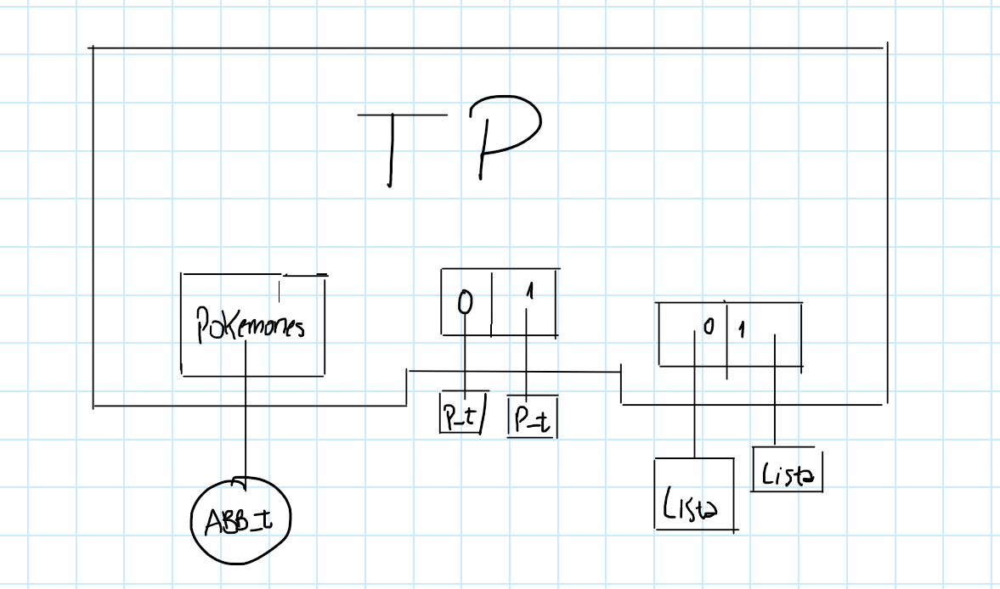
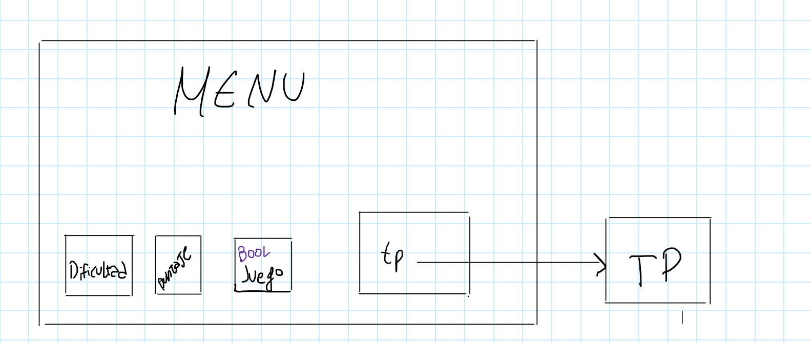

# TP: Carrera de obstáculos

## Repositorio de Maximiliano Rodriguez - 107604 - masrodriguez@fi.uba.ar

- Para compilar:

```bash
make juego
```

- Para ejecutar:

```bash
./juego "ejemplo/pokemones.txt"
```

- Para ejecutar con valgrind:
```bash
make valgrind_juego_correr
```

- Para compilar y ejecutar las pruebas del alumno con valgrind:
```bash
make valgrind-alumno
```

---

## Descripción del Proyecto Práctico

### Dinámica del Juego

En este proyecto, los jugadores participan en una emocionante carrera de obstáculos Pokémon. El juego se desarrolla de la siguiente manera:

Al inicio, al jugador se le presenta por pantalla el tutorial. Luego, observa el pokemon elegido por la IA. Ocurrido esto, el jugador procede a elegir un Pokemon.

Después, el jugador elige la dificultad que desea, observa la pista del oponente y procede a armar su propia pista. 

Una vez configuradas las pistas, se realiza la carrera entre los dos Pokemones. El objetivo principal del juego es que ambos Pokemones lleguen al final de la pista al mismo tiempo o lo más cerca posible.

Después de cada carrera, los jugadores tienen la oportunidad de ajustar la configuración de la pista para mejorar su puntaje. Sin embargo, no pueden cambiar el Pokémon seleccionado. La cantidad de intentos para mejorar el puntaje varía según el nivel de dificultad elegido.

Al final, se puede volver a jugar desde 0 antes de cerrar el programa.

##  Funcionamiento


Para esto se usaron los **TDA TP** y **TDA Menu** 

El TDA TP incluye la siguiente estructura de datos:
- Un árbol binario de búsqueda (`abb`) para almacenar los Pokémon obtenidos desde un archivo `.txt`.
- Un vector con dos elementos de tipo `const struct pokemon_info` para asignar los Pokémon elegidos por cada jugador.
- Dos listas en un vector para guardar los obstáculos creados por cada jugador.

<div align="center">

</div>

El TDA Menu incluye la siguiente estructura de datos:

- `enum TP_DIFICULTAD dificultad`: Es un enumerado (enum) que indica la dificultad seleccionada para el juego. Puede ser una de las siguientes opciones:

  - Fácil
  - Normal
  - Difícil
  - Imposible


- `tp`: Un puntero a TP explicado anteriormente.

- `puntaje`: Double que almacena el puntaje obtenido por el jugador en la carrera de obstáculos de pokemones. 

- `juego`: Booleano que indica si el juego está en curso (true) o si ha finalizado (false). Este campo controla el flujo del juego y permite determinar si se debe continuar ejecutando el juego o si se ha completado.


<div align="center">

</div>


## Funciones utilizadas para el TDA TP

### Lector de archvos

`pokemon_info_leer_lineas` se usa para leer el archivo y guardar los nombres de los Pokemones. La complejidad computacional de `pokemon_info_leer_lineas` es O(n*m), donde n es el número de líneas en el archivo y m es la complejidad de la operación abb_insertar por cada línea leída. `abb_insertar` tiene una complejidad que depende del tamaño del árbol binario de búsqueda (ABB) y puede variar desde O(log n) en el mejor caso (ABB equilibrado) hasta O(n) en el peor caso (ABB degenerado).

---

### Constructor

La funcion `tp_crear` crea una estructura TP. Primero, verifica que el nombre del archivo no sea nulo. Luego, reserva memoria para TP, lee la información de los Pokémon desde un archivo, inicializa dos listas y retorna la estructura creada. La complejidad computacional de tp_crear depende principalmente de la función pokemon_info_leer, ya que las demás operaciones (`calloc, lista_crear, abb_destruir_todo, lista_destruir, free`) tienen complejidades constantes o son insignificantes en comparación con la carga de leer y procesar el archivo de pokemones.

---

### Funciones para elegir pokemones

La funcion `tp_cantidad_pokemon` devuelve el número de pokemones en una estructura TP, y tp_buscar_pokemon busca un pokemon por nombre en la misma estructura y devuelve su información si lo encuentra. La complejidad computacional de tp_buscar_pokemon es O(log n) en el mejor caso y O(n) en el peor caso, donde n es el número de elementos en el árbol binario de búsqueda (`tp->pokemones`). Esto se debe a que la función principal que afecta la complejidad es abb_buscar. Las operaciones de creación y liberación de memoria (`pokemon_info_crear, free`) tienen complejidades constantes.


La función `tp_nombres_disponibles` genera y devuelve una cadena de caracteres que contiene los nombres de todos los pokemones almacenados en un árbol binario de búsqueda (abb), separados por comas. Retorna NULL si falla en alguna operación de memoria o si la estructura TP o el árbol están vacíos. La complejidad computacional de `tp_nombres_disponibles` es O(n^2) en el peor caso, donde n es el número de pokemones en el árbol binario de búsqueda (tp->pokemones). Esto se debe principalmente a la concatenación de cadenas dentro del bucle for, ya que `strcat` tiene una complejidad de O(n) por llamada, y se llama n veces, resultando en una complejidad cuadrática. La operación `abb_recorrer` tiene una complejidad de O(n).


La función `tp_seleccionar_pokemon` asigna un pokemon, buscado por nombre, a uno de dos jugadores en una estructura TP, asegurándose de que el mismo pokemon no sea seleccionado por ambos jugadores. Retorna true si la selección es exitosa, false en caso contrario. La complejidad computacional de tp_seleccionar_pokemon depende principalmente de la función tp_buscar_pokemon. Si asumimos que `tp_buscar_pokemon` tiene una complejidad de O(log n) en el mejor caso y O(n) en el peor caso, donde n es el número de pokemones en el árbol, entonces `tp_seleccionar_pokemon` también tendrá esta complejidad, ya que todas las demás operaciones dentro de la función (comprobaciones de condiciones, asignaciones, comparaciones) tienen una complejidad constante O(1). Por lo tanto, la complejidad total de `tp_seleccionar_pokemon` es O(log n) en el mejor caso y O(n) en el peor caso.

La función `tp_pokemon_seleccionado` devuelve el puntero al pokemon seleccionado por un jugador en la estructura TP. Retorna `NULL` si tp es `NULL` o si el valor de jugador no es válido. La complejidad computacional de tp_pokemon_seleccionado es O(1), constante, ya que realiza una cantidad fija de operaciones independientemente del tamaño de la entrada.

---


### Funciones para obstaculos

La función `tp_agregar_obstaculo` agrega un obstáculo a la pista de uno de los dos jugadores en el juego, identificado por jugador, en la posición especificada. Devuelve el nuevo tamaño de la lista de obstáculos para el jugador correspondiente si la operación es exitosa, o 0 si falla debido a parámetros inválidos, error de memoria, o si la inserción en la lista falla. La complejidad computacional de `tp_agregar_obstaculo` depende de la función `lista_insertar_en_posicion`. Si asumimos que esta función tiene una complejidad de O(n) en el peor caso, donde n es el número de elementos en la lista (debido a que puede necesitar recorrer toda la lista para insertar en una posición específica), entonces la complejidad de `tp_agregar_obstaculo` también es O(n). Todas las demás operaciones dentro de la función tienen complejidades constantes O(1), como asignaciones y comprobaciones de condiciones, por lo que no afectan la complejidad general de la función.

La función `tp_obstaculos_pista` verifica si la estructura TP es válida y si hay obstáculos en la pista del jugador especificado. Si es válido y hay obstáculos, llama a `tp_obstaculos_pista_string` para obtener una representación en cadena de los obstáculos. Retorna NULL si tp es inválido, el jugador no es válido, o no hay obstáculos.

La complejidad computacional de `tp_quitar_obstaculo` es O(n) en el peor caso, donde n es el número de elementos en la lista `tp->obstaculos_pista[jugador]`. Esto se debe a que las operaciones lista_elemento_en_posicion y lista_quitar_de_posicion pueden requerir recorrer hasta posicion elementos en la lista, lo que en el peor caso puede ser igual al tamaño total de la lista. Las demás operaciones tienen complejidades constantes O(1), como las comprobaciones de condiciones y la llamada a free, por lo que no afectan la complejidad general de la función.


La función `tp_limpiar_pista` elimina todos los obstáculos de la pista de un jugador especificado en la estructura TP, liberando la memoria asociada a cada obstáculo. Si la creación de una nueva lista para los obstáculos falla, no realiza ninguna acción adicional. La complejidad depende de la cantidad de obstáculos en la pista de un jugador. Si hay n obstáculos, la complejidad sería O(n), ya que necesita recorrer y liberar cada obstáculo.

La función `tp_calcular_tiempo_pista` calcula el tiempo total que un jugador especificado tarda en superar todos los obstáculos en su pista en el juego, basándose en los atributos del pokemon asignado al jugador. Retorna 0 si hay errores o si no hay obstáculos. Esta función también depende de la cantidad de obstáculos n en la pista de un jugador. La complejidad sería O(n), ya que necesita sumar el tiempo de cada obstáculo.

La función `tp_tiempo_por_obstaculo` genera y devuelve una cadena de caracteres que contiene los tiempos calculados para superar cada obstáculo en la pista de un jugador especificado, separados por comas. Retorna NULL en caso de error o si los parámetros son inválidos.

---

### Destructor


La función `tp_destruir` libera toda la memoria asociada con la estructura TP, incluyendo la memoria de los pokemones almacenados en un árbol binario de búsqueda y los obstáculos en las pistas de ambos jugadores, y finalmente libera la memoria de la estructura TP misma. La complejidad de esta función depende de la cantidad de pokemones almacenados en el árbol binario de búsqueda y la cantidad de obstáculos en las pistas de ambos jugadores. Si hay m pokemones y n obstáculos en total, la complejidad sería O(m + n), asumiendo que la destrucción de cada elemento (pokemon u obstáculo) es una operación de tiempo constante.

---

## Funciones utilizadas para el TDA Menu

El sentido de este TDA es que al tener un booleano en su estructura, se pueden usar las siguientes funciones hasta que ese booleano sea falso, y ahí poder destruir la estructura del menu y terminar el programa.

---

### Constructor

`menu_crear`: Verifica la validez de la ruta de pokemones: Si `ruta_pokemones` es `NULL`, indica al usuario que debe proporcionar un archivo válido y retorna `NULL`.  Crea dinámicamente una estructura `menu_t` usando `malloc`.
Si tp es `NULL`, llama a `tp_crear` para inicializar el TDA TP con la ruta de pokemones. Si no puede crear el TDA TP, libera la memoria asignada a menu y retorna `NULL`. Establece la dificultad, el puntaje y el estado del juego (juego) en sus valores iniciales.
Devuelve el puntero a la estructura menu_t creada con éxito.

---

### Destructor

`menu_destruir`: 
Si menu no es `NULL`, procede con la destrucción.
Llama a `tp_destruir` para liberar la memoria asociada al TDA TP almacenado en menu.
Usa free para liberar la memoria asignada a la estructura menu.

---

### Funciones para comenzar el juego

`menu_imprimir_inicio`:
La función `menu_imprimir_inicio` imprime un mensaje de bienvenida y un dibujo relacionado con la Carrera Pokemon en la pantalla. Utiliza líneas divisorias amarillas para destacar visualmente el contenido y espera a que el usuario interactúe con un mensaje antes de limpiar la pantalla.

`menu_imprimir_tutorial`: Imprime un tutorial (que puede ser salteado) para que el jugador entienda de qué se trata el juego.

---

### Destructor de nombres

`menu_pokemon_destruir_nombres`: Destructor de los nombres de los pokemones.

---

### Funciones para elegir pokemones en el juego

`imprimir_pantalla_pokemones_existentes`: Muestra en la pantalla una lista de nombres de pokemones disponibles para seleccionar en el juego. La lista se imprime en filas de hasta 5 nombres por línea, con un formato específico y utilizando colores para resaltar el pokemon seleccionado.

`menu_cambiar_seleccion`: permite al usuario decidir si desea elegir de nuevo su Pokémon. Muestra un mensaje y espera la entrada del usuario. Si el usuario escribe "No", la función termina. Si escribe "Si", permite al usuario seleccionar de nuevo un Pokémon. La función tiene un mecanismo de protección contra bucles infinitos, limitando las iteraciones a 100. 
La complejidad computacional es O(1) en términos de complejidad algorítmica, ya que el número máximo de iteraciones está fijado a 100, independientemente del tamaño de la entrada. Sin embargo, la complejidad real puede variar dependiendo de las operaciones de la funcion.

La función `menu_ia_elige_pokemon` selecciona aleatoriamente un Pokémon para el jugador 2 (IA) de una lista de nombres disponibles. Realiza los siguientes pasos:

- Obtiene los nombres de los Pokémon disponibles en formato CSV.
- Separa los nombres en un arreglo.
- Si falla, muestra un error y termina.
- Calcula la cantidad total de Pokémon disponibles.
- Genera un número aleatorio dentro del rango de la cantidad de Pokémon.
- Selecciona el Pokémon correspondiente al número aleatorio para el jugador 2.
- Muestra en pantalla el Pokémon seleccionado.
- Espera una interacción del usuario.
- Limpia la memoria utilizada por los nombres.
  
La complejidad computacional es O(n) en el peor caso, donde n es el número de Pokémon disponibles. Esto se debe principalmente a la función split, que debe recorrer la cadena nombres_csv completa para separar los nombres. Las demás operaciones tienen complejidades menores o constantes, pero la operación de división de la cadena domina la complejidad total.

---

### Funciones para elegir la dificultad

La función `menu_elegir_difficultad` (**nótese el typo**) muestra las opciones de dificultad disponibles y espera a que el usuario ingrese una opción válida. Continúa solicitando una opción hasta que se recibe una válida. La complejidad computacional es O(1) en términos de complejidad algorítmica, ya que no depende del tamaño de una entrada. Sin embargo, el tiempo de ejecución real puede variar según cuántas veces el usuario ingrese una opción inválida antes de proporcionar una válida.

La función `menu_cambiar_dificultad` permite al usuario decidir si desea volver a elegir la dificultad del juego. Muestra un mensaje, lee la entrada del usuario, y si el usuario elige "Sí", limpia la pantalla y llama a menu_elegir_difficultad para seleccionar de nuevo. Si elige "No", termina. Maneja entradas inválidas mostrando un mensaje de error y repitiendo el proceso. Complejidad constante.

---

### Funciones para armar pistas

La función `menu_ia_elige_pista` agrega obstáculos aleatorios a la pista del jugador 2 (IA) basándose en la dificultad seleccionada. La cantidad de obstáculos agregados es 4 + 2 * `menu->dificultad`, y el tipo y posición de cada obstáculo son aleatorios.

La complejidad computacional es O(n), donde n es 4 + 2 * `menu->dificultad`. Esto se debe a que el número de iteraciones del bucle for depende directamente del valor de `menu->dificultad`. En el peor de los casos, puede ser O(n^2) por `tp_agregar_obstaculo`.

La función `menu_agregar_obstaculo` permite al usuario agregar un obstáculo a la pista de un jugador especificado. Realiza los siguientes pasos:

Lee y valida la posición donde se agregará el obstáculo.
Convierte la posición leída (cadena) a un entero.
Lee y valida el tipo de obstáculo a agregar.
Llama a `tp_agregar_obstaculo` para agregar el obstáculo en la posición especificada. Al igual que la funcion anterior, depende de `tp_agregar_obstaculo`, por lo que puede llegar a ser O(n^2)

La función `menu_quitar_obstaculo` permite al usuario quitar un obstáculo de la pista de un jugador especificado. Sigue estos pasos:

- Obtiene la lista de obstáculos de la pista del jugador.
- Si la lista está vacía, informa al usuario y retorna.
- Libera la memoria de la lista de obstáculos (esto parece un error, ya que normalmente no se liberaría la lista aquí).
- Solicita al usuario que ingrese la posición del obstáculo a quitar.
- Convierte la entrada del usuario a un entero.
- Valida que la posición sea válida (mayor o igual a 0).
- Llama a tp_quitar_obstaculo para quitar el obstáculo en la posición especificada.
- Libera la memoria asignada para la entrada del usuario.

La complejidad computacional de esta función depende de `tp_quitar_obstaculo`. Si asumimos que `tp_quitar_obstaculo` tiene una complejidad de O(n), donde n es el número de obstáculos en la lista, entonces la complejidad de `menu_quitar_obstaculo` también sería O(n), ya que todas las demás operaciones tienen complejidades menores o constantes.

---

### Funciones de puntaje y tiempos

La función obtener_tiempos_por_obstaculo obtiene una cadena de tiempos que cada obstáculo añade a la carrera de un jugador, los separa por comas y devuelve un arreglo de cadenas con estos tiempos.

La complejidad computacional es O(n), donde n es la longitud de la cadena de tiempos, debido principalmente a la operación de split.

La función `obtener_pista` obtiene la cadena de obstáculos de una pista para un jugador específico, calcula su longitud y devuelve la cadena.

La complejidad computacional es O(n), donde n es la longitud de la cadena de obstáculos, debido a la llamada a strlen.

---

### Implementación de carrera

La función `simular_carrera` simula el progreso de una carrera para el jugador 1, mostrando su posición y tiempo acumulado en cada paso. Cambia el color de la salida en la consola según la posición y el puntaje del jugador. La simulación avanza con la interacción del usuario (presionando Enter).

La complejidad computacional es O(n), donde n es `longitud_pista`, ya que realiza un bucle sobre cada posición de la pista. Las operaciones dentro del bucle son de complejidad constante O(1), por lo que la complejidad total sigue siendo lineal con respecto a la longitud de la pista.

La función `menu_simular_carrera` simula la carrera para el jugador 1. Obtiene los tiempos por obstáculo y la pista, luego simula la carrera y finalmente libera la memoria utilizada.

---

### Más funciones de tiempos y puntajes

La función `calcular_mostrar_tiempos` calcula y muestra los tiempos de carrera para ambos jugadores. La complejidad es O(1) si asumimos que `tp_calcular_tiempo_pista` tiene una complejidad constante, ya que no hay bucles ni operaciones que dependan del tamaño de una entrada.

La función `calcular_puntaje` calcula la diferencia relativa entre dos tiempos (tiempo1 y tiempo2) y la convierte en un puntaje. El puntaje disminuye a medida que la diferencia entre los tiempos aumenta. O(1).

La función `mostrar_mensaje_y_dibujo` muestra un mensaje y un dibujo en la consola basado en el puntaje proporcionado. Elige el color del mensaje y el dibujo a mostrar según el rango en el que se encuentre el puntaje.

La complejidad computacional es O(1), ya que realiza un número fijo de operaciones independientemente del valor de puntaje.

La función `menu_intentos` ejecuta una serie de acciones relacionadas con la carrera un número específico de veces (intentos). En cada iteración, imprime el intento actual, ejecuta acciones de carrera, y si es necesario, pregunta al usuario si desea continuar. Finaliza esperando una entrada del usuario después del último intento.

La complejidad computacional es O(n), donde n es el número de intentos, ya que el bucle se ejecuta intentos veces y las operaciones dentro del bucle son de complejidad constante O(1).

---


### Funciones para el final del juego

La función `menu_preguntar_jugar_de_nuevo` muestra un mensaje inicial, lee y valida la opción del usuario para jugar de nuevo, actualiza el estado del juego basado en esta opción, y luego libera la memoria asignada a la opción.

La complejidad computacional es O(1), ya que todas las operaciones realizadas (mostrar mensaje, leer y validar opción, actualizar estado, liberar memoria) tienen una complejidad constante, independientemente del tamaño de los datos de entrada.

## Conclusión 

Como proyecto final de la materia, este TP me proporcionó un valioso aprendizaje sobre estructuras de datos fundamentales y el proceso de desarrollo de un proyecto desde cero. Además, compartir el juego con amigos y familiares ha sido una gran experiencia, combinando aprendizaje con diversión. Este TP no solo representa el cierre de la materia, a la cual me anoté como optativa, sino también el inicio de nuevas habilidades.


